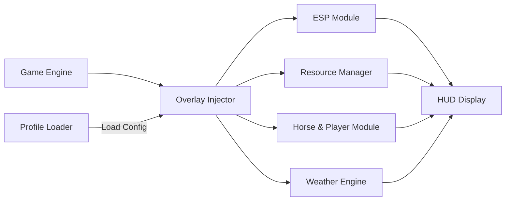

# RDR 2 Trainer 🤠

Take charge of the frontier with **RDR 2 Trainer**, a professional-grade enhancement tool for *Red Dead Redemption 2*. Whether you’re optimizing your outlaw journey, exploring the vast open world, or testing combat mechanics, this trainer provides full modular control — all while keeping your save data and story progress completely safe.

Fine-tuned for **Windows 10/11**, it brings next-level awareness, control, and efficiency to every mission, duel, and ride.

---

## 🧭 Overview

**RDR 2 Trainer** uses a **non-invasive overlay system**, reading the game’s data from the render layer rather than altering files or memory. This ensures perfect stability while providing real-time control over stamina, Dead Eye, cash, weather, and AI tracking.

With live configuration toggles and instant response time, it’s the perfect balance between immersion and control — crafted for both casual adventurers and modding professionals.

---

## ⚙️ Key Features

* **👁 ESP Vision:** Detect animals, enemies, and loot through terrain.
* **💰 Money & Gold Editor:** Safely adjust wallet, satchel, and bank balances offline.
* **💨 Infinite Stamina & Dead Eye:** Ride or fight endlessly with full core regeneration.
* **🎯 Precision Aim Module:** Fine-tune aim stability, reticle sensitivity, and shot spread.
* **🐎 Horse Mastery:** Boost bonding, top speed, and endurance instantly.
* **🌦 Environment Tools:** Change weather, time of day, and fog intensity.
* **📜 Quest Overlay:** Track active missions and collectibles with map markers.
* **🪓 Resource Manager:** Modify ammo, crafting items, and weapon wear levels.

[!IMPORTANT]
The trainer runs in **external overlay mode**, ensuring no edits to internal memory — fully safe for single-player campaigns.

---

## 🧩 Compatibility

| Platform           | Support | Notes                             |
| ------------------ | ------- | --------------------------------- |
| Windows 10         | ✅       | DirectX 11 optimized              |
| Windows 11         | ✅       | DX12 stability confirmed          |
| Steam Edition      | ✅       | Auto-attach supported             |
| Rockstar Launcher  | ✅       | Manual attach                     |
| Epic Games Edition | ⚠️      | Experimental                      |
| Vulkan Mode        | ✅       | Enable `--vk-hook=on`             |
| Online Mode        | ❌       | Not supported; single-player only |

> 💡 *Accessibility Tip:* Use the dark overlay theme in night missions for optimal visibility.

---

## ⚡ Setup Guide

1. **Extract** the Trainer into `C:\RDR2Trainer`.
2. **Launch Red Dead Redemption 2** and reach the main menu.
3. **Run the Trainer as Administrator:**

   ```bash
   RDR2Trainer.exe --inject --safe
   ```
4. Press **F10** to open or close the overlay menu.
5. Activate modules (Stamina, ESP, Money, etc.) or load a pre-made `.rdrt` profile.

**Example Advanced Launch:**

```bash
RDR2Trainer.exe --profile=FrontierScout --frametime-sync --dx=12
```

[!NOTE]
Use **Borderless Windowed Mode** for best overlay performance and accurate coordinate rendering.

---

## 🧠 Config Presets

**1. Outlaw Mastery**

```ini
[player]
stamina=infinite
deadeye=infinite
core_regen=instant
fog_density=0.3
weather=clear
```

**2. Frontier Scout (Exploration)**

```ini
[esp]
entity_outline=on
wildlife_tracking=on
treasure_radar=on
color_enemy=#FF4A4A
color_loot=#FFD700
```

**3. Wealth Builder**

```ini
[resources]
cash=25000
gold=200
ammo_unlimited=true
weapon_wear=clean
```

---

## 🗺 System Diagram



Each system runs independently, ensuring smooth frame pacing even during firefights or cinematic weather transitions.

---

## 🧩 Advanced Flags

| Flag               | Description                              |
| ------------------ | ---------------------------------------- |
| `--safe`           | Secure overlay rendering mode            |
| `--frametime-sync` | Matches overlay updates to game frames   |
| `--dx=12`          | Forces DirectX 12 compatibility          |
| `--vk-hook=on`     | Activates Vulkan API support             |
| `--eco`            | Reduces overlay FPS for lower power draw |
| `--profile=NAME`   | Loads saved configuration                |
| `--record=on`      | Logs performance metrics for testing     |

[!WARNING]
Avoid using both **ESP** and **Full Radar** in 4K resolution on older GPUs — it may reduce frame rate in cinematic scenes.

---

## ❓ FAQ

**Q1: Is the Trainer safe for story mode saves?**
A: 100%. It doesn’t modify memory or save files — all changes are temporary.

**Q2: Can it be used in Red Dead Online?**
A: No — strictly single-player only.

**Q3: Does it support controllers?**
A: Yes — full XInput binding for toggles and quick menu navigation.

**Q4: Why does the overlay flicker sometimes?**
A: Enable `--frametime-sync` or switch to *Borderless Mode* for smooth rendering.

**Q5: How often is it updated?**
A: Regularly — aligned with RDR 2 patches and Windows build updates.

---

## 🧭 Recommended Profiles

* **Frontier Scout:** ESP + Infinite Stamina + Wildlife Tracker.
* **Wealth Builder:** Gold, cash, and inventory management setup.
* **Gunslinger Mode:** Enhanced aim, unlimited ammo, fast reload.

Switch easily:

```bash
RDR2Trainer.exe --profile=Gunslinger
```

---

## 🤠 Final Thoughts

The **RDR 2 Trainer** transforms *Red Dead Redemption 2* into a fully customizable frontier — blending raw immersion with complete control. Perfect for testers, explorers, or those chasing cinematic perfection, it’s the only toolkit you need to redefine the western experience.

Ride strong. Aim true. Own the Wild West.
